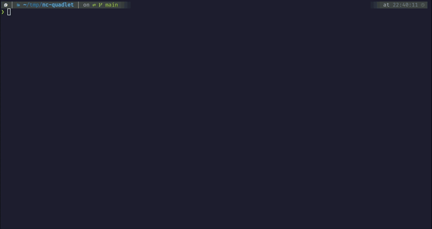

# Documentation

This page shows some example how this language server can be used.

## Configuration for the demos

During the tests, I've used LazyVim distribution of Neovim with the following
LSP configuration in `~/.config/nvim/lua/plugin/quadlet_lsp.lua` file.

```lua
return {
    "neovim/nvim-lspconfig",
    opts = {
        servers = {
            quadlet_lsp = {},
        },
        setup = {
            quadlet_lsp = function(_, _)
                require("lspconfig.configs").quadlet_lsp = {
                    default_config = {
                        cmd = { "quadlet-lsp" },
                        filetypes = { "quadlet" },
                        root_dir = function(_)
                            return vim.fn.getcwd()
                        end,
                    },
                }

                vim.filetype.add({
                    extension = {
                        container = "quadlet",
                        volume = "quadlet",
                        network = "quadlet",
                        pod = "quadlet",
                        image = "quadlet",
                        kube = "quadlet",
                    },
                })

                vim.api.nvim_create_autocmd("FileType", {
                    pattern = "quadlet",
                    callback = function()
                        vim.bo.syntax = "systemd"
                    end,
                })

                return false
            end,
        },
    },
}
```

Features below are implemented to support following file extensions:

- `*.image`
- `*.contianer`
- `*.volume`
- `*.network`
- `*.kube`
- `*.pod`

> [!IMPORTANT]
>
> Only Quadlet part has features in the files below. The generic systemd related
> parts are not covered.

## Hover menu

Provide some information about specific property. See a demo about a container
file in the following video.


## Completion

### Starter template

The `newContainer`, `newVolume`, and so on, provide a started template for
specific files.



### Static completion

Language server provide some static completion based on Podman Quadlet
Documentation, like `Exec`, `Environment`, and so on.


### Templates

Some property has a "new template". If you type them you can get predefined
snippets. Currently supported new templates:

- `new.Annotation`
- `new.AddHost`
- `new.Environment`
- `new.Label`
- `new.PublishPort`
- `new.Secret`
- `new.Volume`


### Dynamic completion

Language server provide some dynamic completion:

- List pulled images and `*.image` files at `Image=`
- List defined secrets at `Secret=`. Also further parameters (type, target)
- List created volumes and `*.volume` files at `Volume=`. Also further
  parameters (rw, ro, z, Z)
- List `*.pod` files at `Pod=`
- List created networks and `*.network` files at `Network=`


### Go definition/references

If you are on a line that points to another file, e.g.: `Pod=nc.pod` and using
the `go definition` function, the file is open.

If you are on a line like `[Pod]`, `[Volume]`, `[Network]`, `[Image]`, then
current work directory is searched for any references to that specific file.


