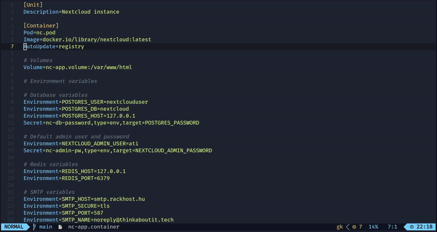
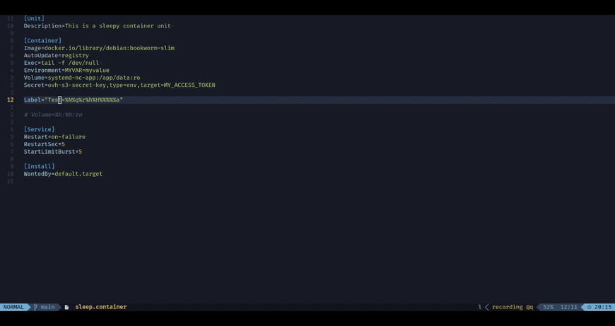
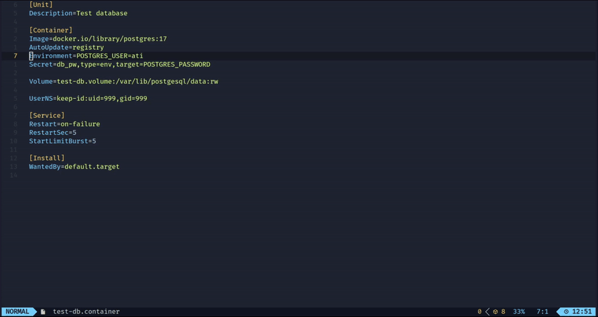
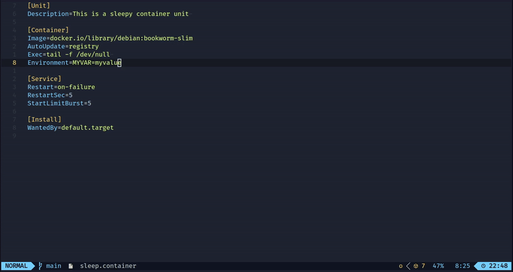

# Features

<!-- toc -->

- [Built-in commands](#built-in-commands)
- [Syntax checking](#syntax-checking)
    * [Disable syntax rule per file](#disable-syntax-rule-per-file)
- [Configuration file](#configuration-file)
- [Format file](#format-file)
- [Hover menu](#hover-menu)
    * [Hover on properties](#hover-on-properties)
    * [Hover on systemd specifiers](#hover-on-systemd-specifiers)
- [Completion](#completion)
    * [Starter template](#starter-template)
    * [Static completion](#static-completion)
    * [Templates](#templates)
    * [Dynamic completion](#dynamic-completion)
    * [Go definition/references](#go-definitionreferences)

<!-- tocstop -->

Features below are implemented to support following file extensions:

- `*.image`
- `*.contianer`
- `*.volume`
- `*.network`
- `*.kube`
- `*.pod`
- `*.build`
- `*.artifact`

Language server also support the drop-ins directories. For example having
`foo.container`. Settings can be override or added in a drop-ins file like
`foo.container.d/10-ports.conf`. On this way settings can be override without
changing the actual Quadlet files.

> [!IMPORTANT]
>
> Only Quadlet part has features in the files below. The generic systemd related
> parts are not covered.

## Built-in commands

Language server provides some command that can be called from IDEs.

| Command name | Neovim Command  | VS Code command          | Description                                                |
| ------------ | --------------- | ------------------------ | ---------------------------------------------------------- |
| listJobs     | QuadletListJobs | Quadlet: List activities | List which background tasks are running                    |
| pulAll       | QuadletPullAll  | Quadlet: Pull All        | Looking for all images in the directory and pull them down |

## Syntax checking

The language server performs syntax checking over the files. For more details,
check the [description of Quadlet Syntax Rules](./qsr.md).

### Disable syntax rule per file

It is possible to suspend specific QSR rules on file and on directory level. On
directory level you must edit the `.quadletrc.json` file, see
[configuration file](#configuration-file).

On file level, it must be specified at the beginning of file. If line starts
with `# disable-qsr:` or `; disable-qsr:` and followed by specific QSR code,
they do not be checked on specific file. See an example.

```ini
# disable-qsr: qsr004

[Container]
Image=library/postgres:17
```

You can put more QSR codes to one line, you can create multiple lines, both
config below are valid.

```ini
# disable-qsr: qsr003 qsr021
[Unit]
Description=...
```

```ini
# disable-qsr: qsr003 qsr021
# disable-qsr: qsr018
[Unit]
Description=...
```

## Configuration file

If `.quadletrc.json` file exists in the current working directory, then some
settings can be override.

- `disabled`: A string array, if any syntax checker source can be found here
  that is ignored.
- `podmanVersion`: Podman version can be specified. It can be useful if you want
  to make Quadlets to another system where older Podman running than on your
  current machine. If omitted, then it try to automatically discover based on
  `podman version` command. If failed, then assumes you are using the highest
  version.

Example for file:

```json
{
  "disabled": ["qsr013", "qsr004"],
  "podmanVersion": "5.4.0"
}
```

## Format file

Language server has feature to format the document. Format has the following
rules:

- Line width does not exceed the 80 character width. If a line is longer, then
  line is split by using `\` continuation sign.
- Each comment line is removed, except from the beginning of the file.
- Properties are grouped based on topics.
- Within the topics, settings are sorted based on alphabetical order.

Example formatted file:

```ini
# disable-qsr: qsr014 qsr013
#
# File name: gitea.container

[Unit]
Description=Gitea application
StartLimitIntervalSec=90
StartLimitBurst=5
Wants=gitea-db.service

[Container]
# Base options
AutoUpdate=registry
Image=docker.io/gitea/gitea:latest-rootless
Pod=gitea.pod

# Storage options
Volume=/etc/localtime:/etc/localtime:ro
Volume=/etc/timezone:/etc/timezone:ro

# Environment options
Environment=GITEA__database__DB_TYPE=postgres
Environment=GITEA__database__HOST=127.0.0.1
Environment=GITEA__database__NAME=gitea
Environment=GITEA__database__USER=gitea

# Secret options
Secret=gitea-db-password,type=env,target=GITEA__database__PASSWD
Secret=gitea-smtp-password,type=env,target=GITEA__mailer__PASSWD

# Healthcheck options
HealthCmd=/bin/curlcurl -k --fail --connect-timeout 5 \
  https://127.0.0.1:3000/api/healthz
HealthRetries=10
HealthStartPeriod=15s
HealthTimeout=15s

# Other options
LogDriver=journald
UserNS=keep-id

[Service]
Restart=on-failure
RestartSec=2

[Install]
WantedBy=default.target

```

## Hover menu

### Hover on properties

Provide some information about specific property. See a demo about a container
file in the following video.



Besides, following property values has hover explanation:

- `UserNS`
- `Volume` (including flags)
- `Secret`

### Hover on systemd specifiers

The
[systemd specifiers](https://www.freedesktop.org/software/systemd/man/latest/systemd.unit.html#Specifiers)
can be used in Quadlets. Language server provide hover functionality for them.



## Completion

### Starter template

The `newContainer`, `newVolume`, and so on, provide a started template for
specific files.


### Static completion

Language server provide some static completion based on Podman Quadlet
Documentation, like `Exec`, `Environment`, and so on.


### Templates

Some property has a "new template". If you type them you can get predefined
snippets. Currently supported new templates:

- `new.Annotation`
- `new.AddHost`
- `new.Environment`
- `new.Label`
- `new.PublishPort`
- `new.Secret`
- `new.Volume`



### Dynamic completion

Language server provide some dynamic completion:

- List pulled images and `*.image` files at `Image=`
- List defined secrets at `Secret=`. Also further parameters (type, target)
- List created volumes and `*.volume` files at `Volume=`. Also further
  parameters (rw, ro, z, Z)
- List `*.pod` files at `Pod=`
- List created networks and `*.network` files at `Network=`
- Gather and list `uid` and `gid` from image if `UserNS=keep-id:` is specified
- Gather exposed ports from image and provide them when `PublishPort` is
  specified. In case of pod, it gather all images exposed ports.
- List systemd specifier (e.g.: `%h`, `%t`, `%n`) whenever write '%' sign



### Go definition/references

If you are on a line that points to another file, e.g.: `Pod=nc.pod` and using
the `go definition` function, the file is open.

If you are on a line like `[Pod]`, `[Volume]`, `[Network]`, `[Image]`, then
current work directory is searched for any references to that specific file.


